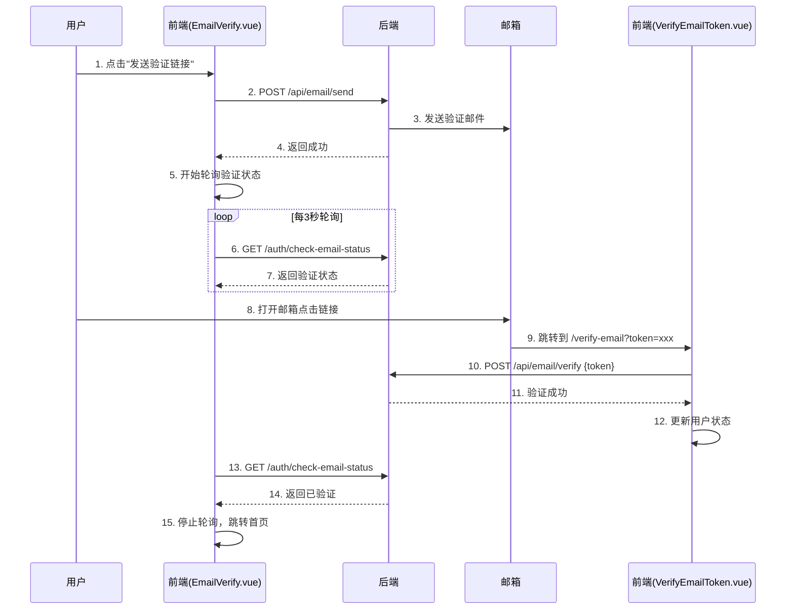

# 邮箱验证接口对接文档

## 📋 准备工作已完成

### ✅ 已完成的前端功能：

1. **EmailVerify.vue 页面**
   - ✅ 发送验证链接功能
   - ✅ 倒计时限制（60秒）
   - ✅ 自动轮询检查验证状态（每3秒）
   - ✅ 手动检查验证状态按钮
   - ✅ 组件卸载时停止轮询

2. **VerifyEmailToken.vue 页面**
   - ✅ 从 URL 获取 token
   - ✅ 调用验证接口
   - ✅ 更新用户验证状态
   - ✅ 错误类型处理（过期/已使用/无效）
   - ✅ 自动跳转

3. **API 接口封装**
   - ✅ `sendEmailVerificationLink()` - 发送验证链接
   - ✅ `verifyEmailByToken(token)` - 验证 token
   - ✅ `checkEmailStatus()` - 检查验证状态

4. **状态管理**
   - ✅ `setEmailVerified(verified)` - 设置验证状态
   - ✅ `refreshEmailStatus()` - 刷新验证状态

---

## 🔌 需要对接的三个后端接口

### 1️⃣ 发送邮箱验证链接

**前端调用位置：** `src/api/auth.js` 的 `sendEmailVerificationLink()`

**接口信息：**
```javascript
// 需要替换的位置（第18-34行）
export const sendEmailVerificationLink = () => {
  return request({
    url: '/api/email/send', // 👈 请提供真实接口路径
    method: 'POST'
  })
}
```

**后端需要做的：**
- 发送包含 token 的验证邮件到用户邮箱
- 邮件中的验证链接应该指向前端地址：
  ```
  https://your-frontend-domain.com/verify-email?token=xxxxx
  ```
  （不是 `https://api.pnrp.cn/email/verify/?token=xxx`）

**期望返回格式：**
```json
{
  "code": 200,
  "msg": "验证链接已发送",
  "data": {
    "email": "user@example.com",
    "expiresIn": 600  // 有效期（秒），可选
  }
}
```

**错误返回：**
```json
{
  "code": 400/500,
  "msg": "错误信息"
}
```

---

### 2️⃣ 验证邮箱 Token

**前端调用位置：** `src/api/auth.js` 的 `verifyEmailByToken(token)`

**接口信息：**
```javascript
// 需要替换的位置（第60-89行）
export const verifyEmailByToken = (token) => {
  return request({
    url: '/api/email/verify', // 👈 请提供真实接口路径
    method: 'POST',
    data: { token }
  })
}
```

**参数：**
```json
{
  "token": "d5f8c8a611034f3ba3de0cba760ad98a"
}
```

**期望返回（成功）：**
```json
{
  "code": 200,
  "msg": "邮箱验证成功",
  "data": {
    "verified": true
  }
}
```

**期望返回（失败）：**
```json
{
  "code": 400,
  "msg": "验证链接已过期",
  "errorType": "expired"  // 可选：'expired' | 'used' | 'invalid'
}
```

---

### 3️⃣ 检查邮箱验证状态

**前端调用位置：** `src/api/auth.js` 的 `checkEmailStatus()`

**接口信息：**
```javascript
// 已经存在，需要确认接口路径是否正确（第91-96行）
export const checkEmailStatus = () => {
  return request({
    url: '/auth/check-email-status', // 👈 请确认接口路径
    method: 'GET'
  })
}
```

**期望返回：**
```json
{
  "code": 200,
  "msg": "OK",
  "data": {
    "isActiveEmail": true  // 或 false
  }
}
```

**用途：**
- EmailVerify.vue 页面每3秒轮询一次
- 用于检测用户在其他设备/浏览器完成验证

---

## 🔄 完整验证流程



---

## 📝 接口对接清单

### 需要后端配合修改：

- [ ] **修改邮件模板**：验证链接改为前端地址
  ```
  原来：https://api.pnrp.cn/email/verify/?token=xxx
  改为：https://your-frontend.com/verify-email?token=xxx
  ```

### 需要提供的接口信息：

- [ ] **发送验证链接接口**
  - 接口路径：`________________`
  - 请求方式：POST
  - 是否需要 token：是 ☐ / 否 ☐

- [ ] **验证 token 接口**
  - 接口路径：`________________`
  - 请求方式：POST
  - 参数格式：确认是否为 `{token: "xxx"}`

- [ ] **检查验证状态接口**
  - 接口路径：`________________`（当前是 `/auth/check-email-status`）
  - 请求方式：GET
  - 返回字段：确认是否为 `isActiveEmail`

---

## 🧪 测试建议

### 开发环境测试：
1. 目前代码有模拟数据，可以先测试前端流程
2. 在 `src/api/auth.js` 中，当 `import.meta.env.DEV` 为 true 时会使用模拟数据

### 生产环境测试：
1. 发送验证链接
2. 检查邮箱收到的链接格式
3. 点击链接验证
4. 确认轮询能检测到验证状态

---

## 💡 注意事项

1. **CORS 跨域**：确保后端接口支持前端域名的跨域请求
2. **Token 安全**：Token 应该足够随机，建议使用 UUID
3. **有效期**：建议 10 分钟，与邮件提示一致
4. **限流**：后端应限制发送频率，防止滥用
5. **幂等性**：验证接口应该是幂等的（多次调用结果一致）

---

## ✅ 接口对接完成后的替换步骤

1. 在 `src/api/auth.js` 中找到对应函数
2. 删除 `if (import.meta.env.DEV)` 开发环境的模拟代码
3. 更新 `request()` 中的 `url` 为真实接口路径
4. 测试完整流程

---

📌 **等待接口信息后，我会帮你完成最后的接入工作！**
